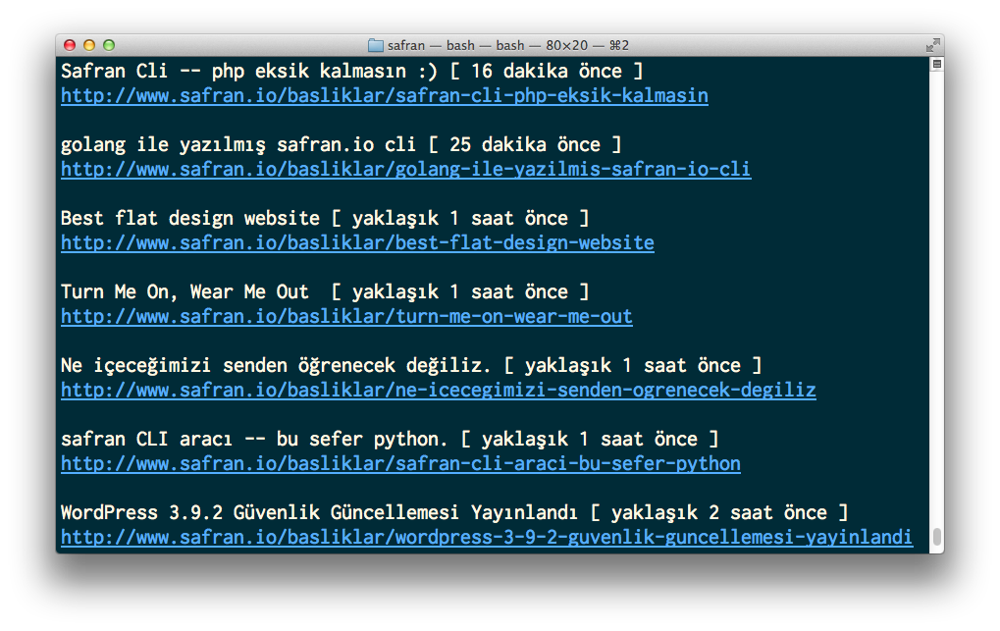

# Safran Ruby CLI

[Safran.io](http://safran.io) için Ruby ile yazılmış Command Line okuyucusu.

Orijinal [kod](https://github.com/Sdogruyol/safran)

## Farklar

* Zaman bildirimi (_XXX saat önce_...)
* Localizasyon (_tr, en_)
* Rake task’ler, development ve test
* RSpec3 syntax update

## Screenshot

## Safran Nedir?

[http://www.safran.io/hakkinda](http://www.safran.io/hakkinda) sayfasından:

> Safran yaratıcı servisler ve ürünler tasarlayan/geliştiren topluluklar için düşünülmüş, şimdilik sadece davetlilere açık bir sosyal haber ve paylaşım ağıdır. Severek takip ettiğimiz Hacker News ve Designer News gibi sitelerin Türkçe konuşanlar için bir uyarlamasıdır.

## Lisans

[MIT License](http://f.mit-license.org)